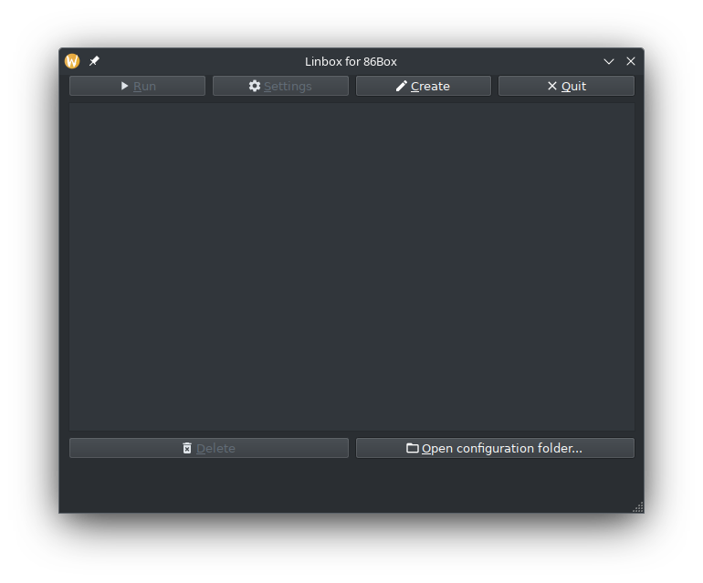

# linbox-qt5

A manager for 86Box written in Python using the PySide framework.

Aims to be simple and easy to use, might increase its scope in the future.



Currently only supports 86Box installed from a package manager, Flatpak/AppImage versions will not work.

## Usage

**Do not use the included setup.py, stick to running directly from python.**

```
git clone https://github.com/Dungeonseeker/linbox-qt5
cd linbox-qt5
$ python linbox.py
You need to install Pyside6, xdgenvpy & show-in-file-manager from pip
```

## Know issues, ToDos & Misc

See [CHANGELOG](./CHANGELOG) for details

# License

1. This software is provided as is under the MIT Open Source License. See [LICENSE.md](./LICENSE.md) for details.
2. This software uses Google material icons.
